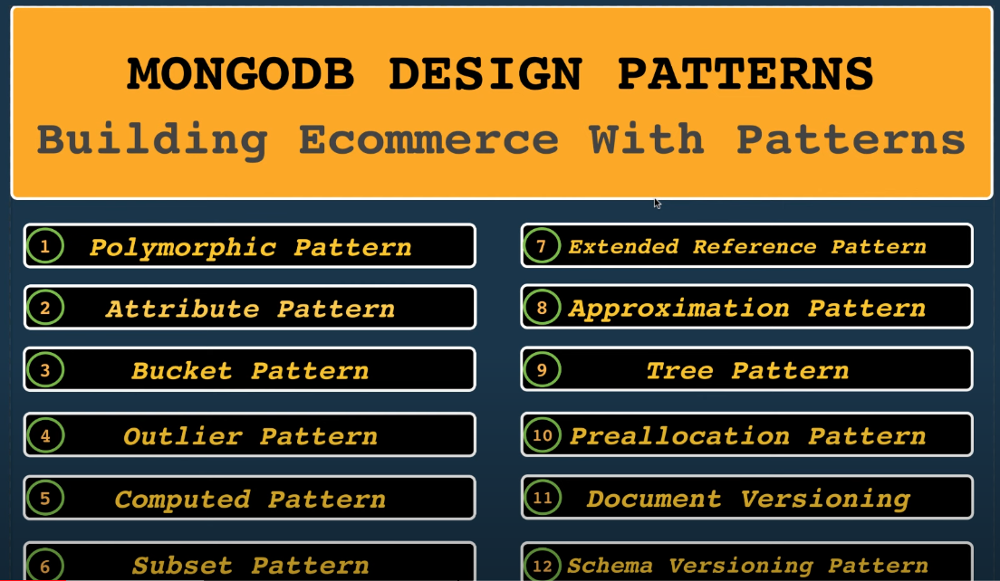
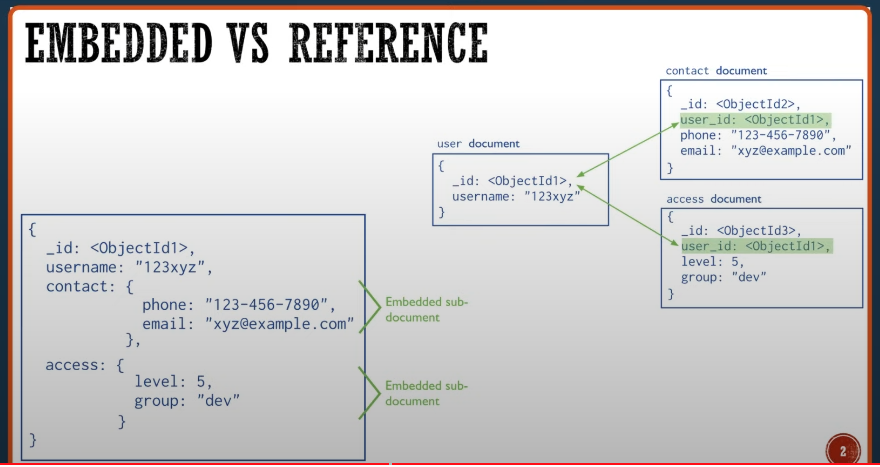

  

#  Mongo DB chọn B-TREE

  

*  

  

#  Embedding vs. Referencing

  

*  MongoDB sẽ cho ta 2 lựa chọn khi thiết kế dữ liệu. Chúng ta có thể gắn dữ liệu trực tiếp vào object (EMBEDDING) , hoặc reference chúng và sử dụng $lookup operation để query.

  

*  Reference mặc dù cơ bản tương tự với Relation trong SQL, nhưng MongoDB không cung cấp các tính năng quan hệ như khóa ngoại (foreign key) hoặc các ràng buộc (constraints) tự động liên quan đến việc duy trì tính toàn vẹn tham chiếu.

  

* <h3> Ưu điểm của Reference: </h3>

	- Sử dụng reference cho phép tránh việc lặp lại thông tin trong nhiều tài liệu. Thay vì nhúng thông tin vào mỗi tài liệu, chỉ cần lưu trữ một ObjectID tham chiếu đến tài liệu liên quan.

	- <b> Việc phải query ra các dữ liệu thừa cũng hạn chế hơn</b>

	-  Khi chia tách data ra, chúng ta sẽ hạn chế được dung lượng phải lưu trong các documents 

 
* <h3> Hạn chế của Reference:</h3>

	-  Khi cần lấy thông tin từ các tài liệu liên quan, phải thực hiện nhiều truy vấn để truy xuất dữ liệu
  
	-  Không có tính toàn vẹn tham chiếu tự động: MongoDB không tự động duy trì tính toàn vẹn tham chiếu như các hệ quản trị cơ sở dữ liệu quan hệ truyền thống. Phải tự đảm bảo tính toàn vẹn tham chiếu bằng cách kiểm tra và quản lý các tài liệu liên quan.

* <h3> Ưu điểm của Embbed: </h3>

	-    Khi query ta có thể lấy tất cả các dữ liệu liên quan trong 1 query

	-   Tránh việc sử dụng join với nhiều bảng như bên relational hoặc sử dụng lookup

	-    Update các thông tin liên quan cũng trong một câu lệnh query

 
* <h3> Hạn chế của Embbed:</h3>
       
	-   Với mỗi document trong mongoDB chỉ giới hạn tối đa là 16MB. Do đó việc lưu quá nhiều data có thể dẫn đến việc tràn giới hạn này
	-   Lấy các dữ liệu trong một câu query cũng đồng nghĩa với việc có thể ta sẽ lấy ra những dữ liệu không cần thiết. Ta có thể cải thiện chúng bằng cách hạn chế size của document trong mỗi câu query

*  

