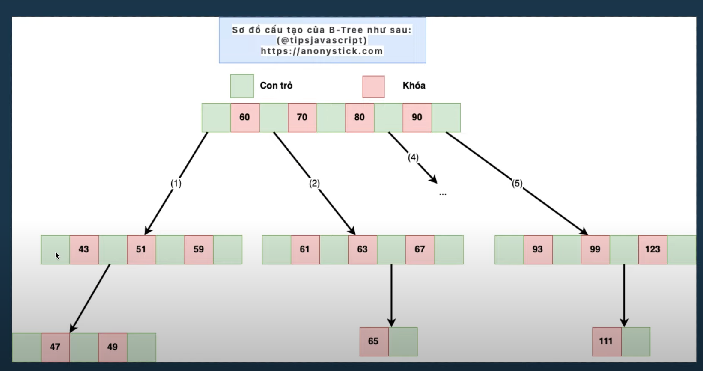
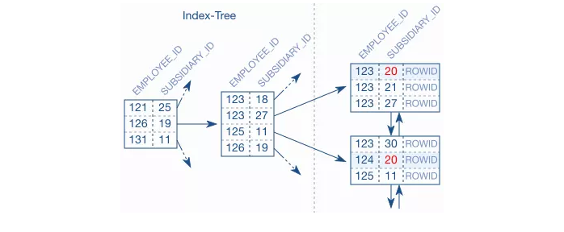
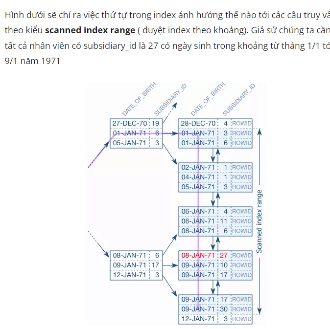
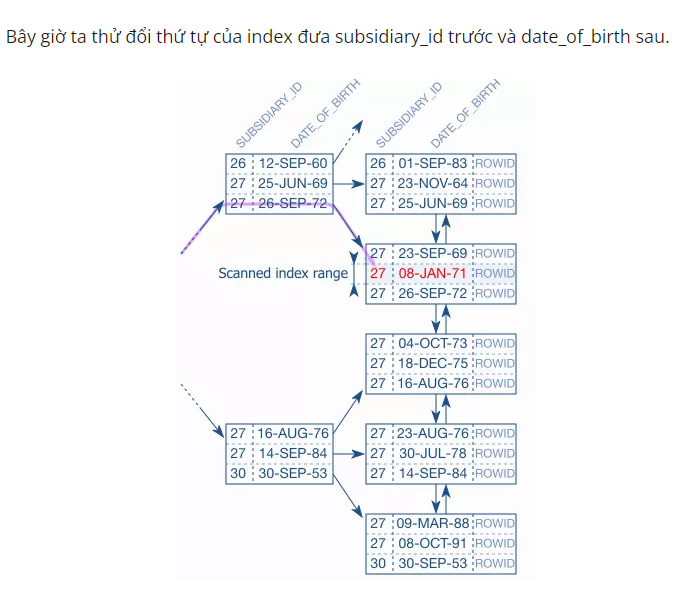
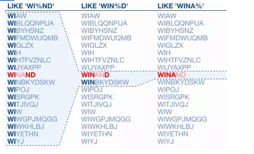

  

#  PostgreSQL

  

  

*  Trong PostgreSQL, có hai loại chỉ mục liên quan đến khái niệm cluster: cluster index và non-cluster index.

  

  

-  Cluster Index: Cluster index trong PostgreSQL được sử dụng để sắp xếp dữ liệu trong bảng theo thứ tự của chỉ mục.

  

-  <b>Một bảng chỉ có thể có một cluster index duy nhất</b>. Khi bạn tạo một cluster index, dữ liệu trong bảng sẽ được tổ chức lại (reclustered) theo thứ tự của chỉ mục. Cluster index thường được sử dụng trong các trường hợp khi bạn muốn tối ưu hóa truy vấn dựa trên một trường hoặc một nhóm trường có mối quan hệ gần nhau và thường được truy vấn cùng nhau.

  

  

-  Non-cluster Index:<b> Non-cluster index trong PostgreSQL là loại chỉ mục thông thường, không yêu cầu dữ liệu trong bảng được tổ chức lại </b>. Non-cluster index được sử dụng để hỗ trợ truy vấn dựa trên một hoặc nhiều trường trong bảng. Một bảng có thể có nhiều non-cluster index. Non-cluster index thường được sử dụng trong các trường hợp khi bạn muốn tìm kiếm, sắp xếp hoặc thực hiện các phép so sánh trên một hoặc nhiều trường dữ liệu.

  

  

*  Khi bạn tạo chỉ mục trong PostgreSQL, bạn có thể xác định loại chỉ mục bằng cách sử dụng từ khóa CLUSTER hoặc NONCLUSTER. Nếu không xác định rõ, chỉ mục sẽ mặc định là non-cluster index.

  

  

*  Vui lòng lưu ý rằng việc sử dụng cluster index hay non-cluster index phụ thuộc vào yêu cầu truy vấn và cấu trúc dữ liệu cụ thể trong hệ thống của bạn. Bạn nên xem xét và kiểm tra hiệu suất truy vấn để quyết định sử dụng loại chỉ mục phù hợp.

  

*  Khi thực hiện truy vấn WHERE trên cột "name" và sử dụng index, PostgreSQL sẽ sử dụng cấu trúc cây B-tree để tìm kiếm giá trị trong index. Quá trình tìm kiếm sẽ diễn ra từ nút gốc của cây B-tree và đi xuống các nút con cho đến khi tìm thấy nút chứa giá trị tương ứng.

  

  

*  Mỗi nút trong cây B-tree chứa giá trị tìm kiếm (search key) và tham chiếu đến dữ liệu trong bảng gốc (data reference). Khi tìm thấy nút chứa giá trị tìm kiếm cần thiết, PostgreSQL sẽ sử dụng tham chiếu đó để truy cập vào dữ liệu trong bảng gốc và trả về kết quả của truy vấn.

  

  

*  Tóm lại, cột "name" sẽ được tổ chức lại theo cấu trúc cây B-tree khi đánh index. Khi sử dụng truy vấn WHERE trên cột "name" và index, PostgreSQL sẽ tìm kiếm trên cây B-tree để xác định nút chứa giá trị tìm kiếm và sử dụng tham chiếu trong nút đó để truy cập vào dữ liệu trong bảng gốc.

  

  

id name

  

1 x3

  

2 x2

  

3 x5

  

4 x6

  

  

*  

  

  

*  

  

  

#  COMPOSITE INDEX

  

  

- Dưới đây là một ví dụ về composite index và thứ tự sắp xếp dựa trên không gian mẫu lớn hơn.

  

  

Giả sử chúng ta có một bảng "employees" với các cột sau:

  

  

id: kiểu số nguyên, đại diện cho ID của nhân viên

  

last_name: kiểu chuỗi, đại diện cho họ và tên đệm của nhân viên

  

first_name: kiểu chuỗi, đại diện cho tên của nhân viên

  

department: kiểu chuỗi, đại diện cho phòng ban của nhân viên

  

Chúng ta muốn tạo một composite index trên cặp cột (last_name, department). Điều này có nghĩa là dữ liệu sẽ được sắp xếp theo thứ tự tăng dần của last_name trước, và trong trường hợp có last_name giống nhau, thì sẽ sắp xếp theo thứ tự tăng dần của department.

  

  

Ví dụ:

  

  

(last_name, department) = ('Smith', 'Sales')

  

(last_name, department) = ('Smith', 'HR')

  

(last_name, department) = ('Johnson', 'Sales')

  

(last_name, department) = ('Johnson', 'IT')

  

Dữ liệu sẽ được sắp xếp theo thứ tự như sau:

  

  

('Johnson', 'IT')

  

('Johnson', 'Sales')

  

('Smith', 'HR')

  

('Smith', 'Sales')

  

<h3> Việc đánh index trên cột nên được xem xét dựa trên các yếu tố sau: </h3>

  

1.  Selectivity: Đánh index trên các cột có selectivity cao sẽ giúp cải thiện hiệu suất truy vấn. Các cột có selectivity cao có nghĩa là có giá trị duy nhất hoặc có số lượng giá trị phân biệt lớn. Ví dụ, cột ID hoặc cột email có thể có selectivity cao.

2.  Truy vấn thường xuyên: Xem xét các truy vấn mà bạn thường xuyên thực hiện trên cột. Nếu một cột thường xuyên xuất hiện trong các điều kiện tìm kiếm, sắp xếp hoặc kết hợp, đánh index trên cột đó có thể giúp cải thiện hiệu suất truy vấn.

3.  Kích thước dữ liệu: Cột có kích thước dữ liệu nhỏ hơn thường là ứng viên tốt để đánh index. Index trên các cột với dữ liệu lớn có thể tốn nhiều tài nguyên lưu trữ và làm chậm quá trình truy vấn.

4.  Loại dữ liệu: Đánh index trên các loại dữ liệu có thứ tự (như số, ngày tháng) thường có hiệu suất tốt hơn so với loại dữ liệu không có thứ tự (như văn bản).

5.  Tránh đánh index trên các cột với dữ liệu không đủ đa dạng hoặc không sử dụng trong truy vấn.

>Khi cột không có dữ liệu đa dạng như "is_active" với chỉ hai giá trị "true" và "false", việc đánh index lên cột này có thể không đem lại lợi ích hiệu suất đáng kể vì các lý do sau:

  

>Sự không đa dạng của dữ liệu: Khi chỉ có hai giá trị khác nhau trong cột, index sẽ không cung cấp nhiều thông tin để phân loại và tìm kiếm dữ liệu. Một index hiệu quả yêu cầu dữ liệu có đủ đa dạng để tạo ra các cây b-tree phân cấp và chia nhỏ dữ liệu một cách hiệu quả. Trong trường hợp này, chỉ có hai giá trị, việc chia nhỏ và tìm kiếm dữ liệu không đem lại lợi ích rõ rệt.

>  Không tận dụng index: Truy vấn sử dụng cột "is_active" trong điều kiện WHERE có thể không tận dụng index một cách hiệu quả. Khi chỉ có hai giá trị, truy vấn sẽ phải quét toàn bộ dữ liệu để tìm các bản ghi thỏa mãn điều kiện. Trong trường hợp này, việc sử dụng index có thể không cung cấp tốc độ truy vấn nhanh hơn so với quét toàn bộ dữ liệu.

>  Tăng kích thước lưu trữ: Đánh index trên cột không đa dạng có thể tăng kích thước lưu trữ của cơ sở dữ liệu mà không đem lại lợi ích hiệu suất đáng kể. Index sẽ tiêu tốn không gian lưu trữ và tăng thời gian cập nhật dữ liệu khi có thay đổi trong cột.

  

>Tuy nhiên, cần lưu ý rằng quyết định đánh index trên một cột nên dựa trên các yếu tố khác như mức độ truy vấn, tần suất cập nhật dữ liệu, và yêu cầu hiệu suất của ứng dụng cụ thể. Trong một số trường hợp, index trên các cột không đa dạng có thể vẫn hữu ích trong việc tối ưu hóa truy vấn hoặc phục vụ cho mục đích khác như sắp xếp dữ liệu.

  
  

*  INDEX UNIQUE SCAN: Kiểu này là chỉ có duyệt cây thôi, kiểu này được dùng khi tìm kiếm trong một trường có ràng buộc unique đảm bảo rằng có duy nhất một bản ghi thỏa mãn

  

*  INDEX RANGE SCAN: Kiểu này sẽ là vừa duyệt cây vừa duyệt theo leaf node để tìm tất cả bản ghi thỏa mãn, chạy khi có khả năng có nhiều bản ghi thỏa mãn kết quả tìm kiếm

>  SELECT * FROM orders WHERE order_date BETWEEN '2023-01-01' AND '2023-12-31';

  
  

>  CREATE UNIQUE INDEX employees_pk ON employees (employee_id, subsidiary_id)
``SELECT first_name, last_name FROM employees WHERE subsidiary_id = 20``

Với câu lệnh này xem trong execution plan thay vì sử dụng index database lại sử dụng TABLE ACCESS FULL nghĩa là nó duyệt hết các bản ghi trong bảng và so sánh với điều kiện

Nhìn chung index kết hợp cũng vẫn là B-Tree để giữ các cục index được sắp xếp theo thứ tự như index 1 trường. Nhưng vì có hai trường nên database sắp xếp ưu tiên trường được đánh index đầu tiên trước (EMPLOYEE_ID) rồi sau đó sắp xếp tới các trường sau (SUBSIDIARY_ID).  Nghĩa là index không hỗ trợ tìm kiếm theo trường thứ hai
*   
* Nên đánh composite index theo thứ tự mà data càng unique thì xếp trước: Vd employee_id_date_birth chứ ko phải date_birth_employee_id
*  
>Hình trên mô tả trường hợp đánh index theo thứ tự trường date_of_birth trước và subsidiary_id sau. Nhìn trên hình các bạn sẽ thấy index được sắp thứ tự theo date_of_birth và subsidiary_id chỉ có ý nghĩa khi date_of_birth có giá trị bằng nhau. Vì vậy câu truy vấn index thực hiện theo DATE_OF_BIRTH, và SUBSIDIARY_ID được sử dụng rất hạn chế khi duyệt cây. Bạn có thể thấy trên hình ở leaf node có chứa bản ghi có SUBSIDIARY_ID bằng 27, nhưng ở node cành không hề có. Vì vậy trong trường hợp này điều kiện để dừng việc duyệt theo index chỉ phụ thuộc vào DATE_OF_BIRTH. Nó duyệt qua 5 leaf node như hình bên trên.
*  
> Như hình trên có thể thấy việc tìm kiếm bản ghi được thực hiện ngay lập tức không cần duyệt qua nhiều leaf node. Tại sao lại như vậy? Bởi vì đầu tiên so sánh bằng sẽ lấy ra các bản ghi có giá trị SUBSIDIARY_ID=27 đã được lấy ra, việc tiếp theo là duyệt index để tìm giá trị DATE_OF_BIRTH trong khoảng phù hợp. Vì giá trị SUBSIDIARY_ID=27 bằng nhau cho các giá trị được lấy ra lúc này việc sort theo DATE_OF_BIRTH trở lên có giá trị. Lúc này không cần phải duyệt ngược lại để tìm kiếm giá trị phù hợp, bởi vì trên branch node bạn đã thấy không có bản ghi nào lớn hơn giá trị 26/06/1969 trên leaf node trước đó. Lúc này database sẽ duyệt trực tiếp vào node thứ hai (Từ cục 23-SEP-69 đến cục 26-SEP-72) và kết thúc luôn việc duyệt.

> Rule : Luôn index cho giá trị truy vấn trong toán tử bằng trước, sau đó đến range
* Trong việc tìm kiếm theo LIKE, chỉ có những ký tự đứng trước wild card đầu tiên có thể được dùng trong index. còn lại sẽ không được sử dụng trong ví dụ trên việc tìm kiếm theo WIN sẽ được tìm theo index còn D thì không. Trong ví dụ trên thì phần **WIN** sẽ dùng trong phần access trong predicate còn phần D thì ở trong phần filter ( access là chọn điểm đầu và điểm cuối trên leaf node còn filter là việc duyệt trên leaf node). Tại sao chỉ phần trước theo được index mà phần sau lại không được? bạn có thể xem hình sau:
*  
* LIKE chỉ có thể index được nếu % không đứng đầu, và càng ở sau thì càng có hiệu quả, trong trường hợp Like với % ở đầu tiên các bạn nên có các điều kiện khác để hạn chế số lượng bản ghi lại nếu không sẽ quét toàn bộ bảng. Trong trường hợp không tránh được các bạn nên sử dụng Fulltext Index.