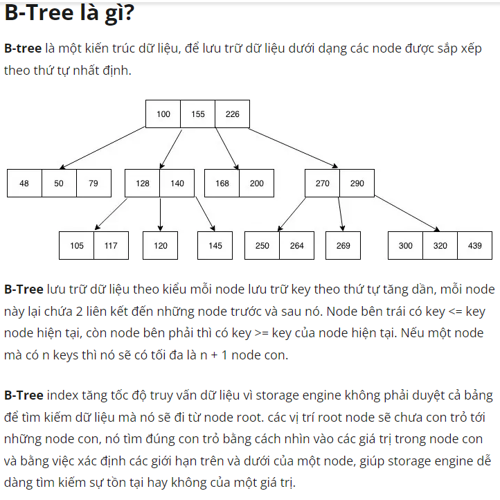

# PostgreSQL

* Trong PostgreSQL, có hai loại chỉ mục liên quan đến khái niệm cluster: cluster index và non-cluster index.

    - Cluster Index: Cluster index trong PostgreSQL được sử dụng để sắp xếp dữ liệu trong bảng theo thứ tự của chỉ mục. 
     
    - <b>Một bảng chỉ có thể có một cluster index duy nhất</b>. Khi bạn tạo một cluster index, dữ liệu trong bảng sẽ được tổ chức lại (reclustered) theo thứ tự của chỉ mục. Cluster index thường được sử dụng trong các trường hợp khi bạn muốn tối ưu hóa truy vấn dựa trên một trường hoặc một nhóm trường có mối quan hệ gần nhau và thường được truy vấn cùng nhau.

    - Non-cluster Index:<b> Non-cluster index trong PostgreSQL là loại chỉ mục thông thường, không yêu cầu dữ liệu trong bảng được tổ chức lại </b>. Non-cluster index được sử dụng để hỗ trợ truy vấn dựa trên một hoặc nhiều trường trong bảng. Một bảng có thể có nhiều non-cluster index. Non-cluster index thường được sử dụng trong các trường hợp khi bạn muốn tìm kiếm, sắp xếp hoặc thực hiện các phép so sánh trên một hoặc nhiều trường dữ liệu.

*  Khi bạn tạo chỉ mục trong PostgreSQL, bạn có thể xác định loại chỉ mục bằng cách sử dụng từ khóa CLUSTER hoặc NONCLUSTER. Nếu không xác định rõ, chỉ mục sẽ mặc định là non-cluster index.

* Vui lòng lưu ý rằng việc sử dụng cluster index hay non-cluster index phụ thuộc vào yêu cầu truy vấn và cấu trúc dữ liệu cụ thể trong hệ thống của bạn. Bạn nên xem xét và kiểm tra hiệu suất truy vấn để quyết định sử dụng loại chỉ mục phù hợp.

Khi thực hiện truy vấn WHERE trên cột "name" và sử dụng index, PostgreSQL sẽ sử dụng cấu trúc cây B-tree để tìm kiếm giá trị trong index. Quá trình tìm kiếm sẽ diễn ra từ nút gốc của cây B-tree và đi xuống các nút con cho đến khi tìm thấy nút chứa giá trị tương ứng.

Mỗi nút trong cây B-tree chứa giá trị tìm kiếm (search key) và tham chiếu đến dữ liệu trong bảng gốc (data reference). Khi tìm thấy nút chứa giá trị tìm kiếm cần thiết, PostgreSQL sẽ sử dụng tham chiếu đó để truy cập vào dữ liệu trong bảng gốc và trả về kết quả của truy vấn.

Tóm lại, cột "name" sẽ được tổ chức lại theo cấu trúc cây B-tree khi đánh index. Khi sử dụng truy vấn WHERE trên cột "name" và index, PostgreSQL sẽ tìm kiếm trên cây B-tree để xác định nút chứa giá trị tìm kiếm và sử dụng tham chiếu trong nút đó để truy cập vào dữ liệu trong bảng gốc.

id	name
1	x3
2	x2
3	x5
4	x6

*  